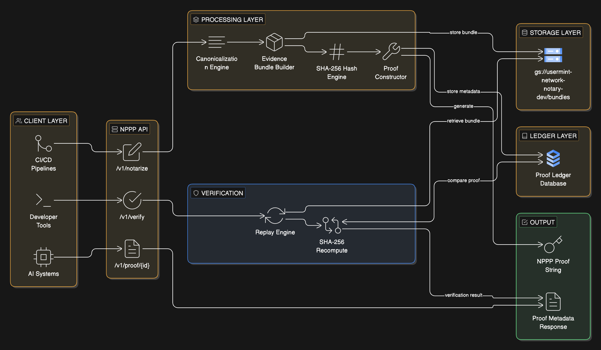

# NPPP Architecture

The **Notarization Proof Packet Protocol (NPPP)** is a network-level proof of provenance system designed to generate, store, and verify cryptographic evidence of digital artifacts.

It operates as a layered architecture that separates submission, processing, storage, and verification into deterministic, replayable components.

---

## System Overview

NPPP enables any system to:

- Submit an artifact for notarization
- Generate a deterministic proof string
- Store verifiable evidence bundles
- Replay verification independently at any time

The protocol guarantees that any valid proof can be verified by recomputing the SHA-256 hash of the original evidence bundle.

---

## Architectural Layers

| Layer | Responsibility |
|------|----------------|
| Client Layer | CI/CD pipelines, developer tools, AI systems |
| API Layer | Receives notarization and verification requests |
| Processing Layer | Canonicalization, bundle building, hashing, proof construction |
| Storage Layer | Stores deterministic evidence bundles |
| Ledger Layer | Stores proof metadata and identifiers |
| Verification Layer | Replays hash verification against stored bundles |

---

## Layer Descriptions

### Client Layer
The client layer includes all external systems interacting with NPPP.

Examples:
- CI/CD pipelines notarizing builds
- Developer tools registering datasets
- AI systems generating provenance proofs

Clients submit artifacts and later verify proofs using the API.

---

### API Layer
The API layer exposes the protocol through three endpoints:

- `POST /v1/notarize`
- `POST /v1/verify`
- `GET /v1/proof/{id}`

This layer acts as the gateway between external systems and internal processing logic.

---

### Processing Layer
The processing layer is responsible for deterministic proof generation.

It performs:

1. **Canonicalization**
   - Normalizes input artifacts into a deterministic format

2. **Evidence Bundle Construction**
   - Packages all relevant inputs into a reproducible bundle

3. **Hashing**
   - Computes a SHA-256 hash of the bundle

4. **Proof Construction**
   - Encodes metadata and hash into a standardized NPPP proof string

This layer ensures that identical inputs always produce identical proofs.

---

### Storage Layer
The storage layer persists the raw evidence required for verification.

- Evidence bundles are stored in:
  - `gs://usermint-network-notary-dev/bundles`

These bundles are immutable and serve as the source of truth for verification.

---

### Ledger Layer
The ledger layer stores proof metadata.

It includes:
- Proof ID
- Artifact type
- Bundle location
- SHA-256 hash
- Timestamp

This layer enables lookup, traceability, and auditability of proofs.

---

### Verification Layer
The verification layer performs replay validation.

It executes:

1. Retrieve the bundle from storage
2. Recompute the SHA-256 hash
3. Compare against the proof’s hash

Verification succeeds only if:
computed_hash == proof_hash
Copy code

This ensures that the proof is cryptographically valid and has not been tampered with.

---

## Architecture Execution View

See the execution-level flow:

- [Architecture Execution Diagram](../diagrams/nppp_architecture.mmd)

---

## Visual Architecture

---

## Key Properties

### Determinism
Identical inputs produce identical outputs.

### Verifiability
Any proof can be independently verified without trust in the original system.

### Replayability
Verification is performed by recomputing the original hash from stored evidence.

### Transparency
All proof components are inspectable and auditable.

---

## Summary

NPPP is not just an API—it is a deterministic proof system.

By separating:
- submission
- processing
- storage
- verification

it enables a trust-minimized architecture where proofs can be validated independently of the system that generated them.
